# LABORATORIO · ToDo FULL STACK

**Escuela Colombiana de Ingeniería Julio Garavito**  
**Curso:** Desarrollo y Operaciones de Software - DOSW  
**Caso de estudio:** ToDo · Sistema para gestión de tareas  
**Docente:** Rodrigo Gualtero

# BACK-END
Eete repositorio gestiona la lógica principal de ToDo.
First app to intagrate technologies needed to create a basic service software structure

#### NOTA: Los requerimientos y las descripcíón del proyecto se encunetran ubicados en /docs/requirements/requiremnets.md

---

# PARTE 1 · SCAFFOLDING DEL PROYECTO

# 7. Crear la estructura base

Crear un repositorio con la siguiente estructura:

```text
todo-fullstack/
│
├── backend/
├── frontend/
├── database/
│   └── 001_create_schema.sql
│
├── docs/
│   └── evidence/
│
└── README.md
```

```text
Por cuestiones de aprendizaje y recomendación, opté por dos repositorios diferentes: Uno para el backend y el otro para 
el frontend.

back-end-lab06/
│
├── database/
│   └── 001_create_schema.sql
├── src/
├── docs/
│
├── .gitignore
└── README.md

front-end-lab06/
│
├── docs/
│
├── .gitignore
└── README.md
```


---

# 8. Crear el Back-end con Spring Initializr

Ingresar a:

https://start.spring.io/

Configurar:

```text
Project: Maven
Language: Java
Packaging: Jar
Java: 21
```

Metadata:

```text
Group:
edu.eci.dosw

Artifact:
todo-api

Name:
todo-api

Package:
edu.eci.dosw.todo
```

Dependencias:

- Spring Web
- Spring Data JPA
- PostgreSQL Driver
- Validation
- Spring Boot Starter Test (AUTOMÁTICA)


Ubicar el proyecto generado dentro del repositorio de back-end:

```text
back-end-lab06/
```

Verificar:

```text
Para ejecutar correctamente fué necesario ignorar el llamado a las bases de datos (donde no hay lógica inicial) temporalmente mientras se implementa funcionamiento. Para ello agregué las siguiente línea en appplication.properties:

# Temporal to be able to run correctly
spring.autoconfigure.exclude=org.springframework.boot.jdbc.autoconfigure.DataSourceAutoConfiguration,org.springframework.boot.hibernate.autoconfigure.HibernateJpaAutoConfiguration

Además de docuementar la notación del //@SpringBootTests de las pruebas TodoApplicationTests.java (temporalmente mientras la implementación)
```

```bash
cd backend
mvn clean test
```


Ejecutar:

```bash
mvn spring-boot:run
```
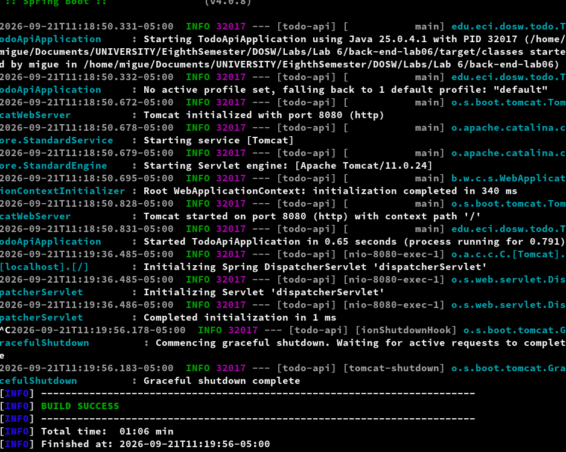

---

# 9. Crear la estructura del Back-end

Crear los paquetes:

```text
back-end-lab06/
│
├── database/
│   └── 001_create_schema.sql
├── docs/
│
├── src/
│   ├── main/
│   │   └── java/
│   │       └── edu/eci/dosw/todo/
│   │           ├── controller/
│   │           ├── service/
│   │           ├── repository/
│   │           ├── entity/
│   │           ├── dto/
│   │           ├── exception/
│   │           ├── config/
│   │           └── TodoApplication.java
│   │
│   └── test/
│       └── java/
│           └── edu/eci/dosw/todo/
│
├── .gitignore
└── README.md
```

```text
Como mencioné anteriormente, al dividir el proyecto en dos microservicios distintos, el scaffolding del backend cambió, 
al colocar en la raiz de la repo, la lógica de la base de datos en la carpeta database/ así como cada una de 
las carpetas que alojarán la lógica del negocio y demás componentes del servicio.
```


---

# PARTE 2 · POSTGRESQL CON DOCKER

# 10. Descargar la imagen oficial de PostgreSQL

Para este laboratorio **no se instalará PostgreSQL directamente en el equipo**.

La idea es utilizar la imagen oficial disponible en Docker Hub.

Descargar la imagen:

```bash
docker pull postgres:17-alpine
```

Verificar que la imagen esté disponible localmente:

```bash
docker images
```

Deberá aparecer una imagen similar a:

```text
REPOSITORY   TAG         IMAGE ID       CREATED        SIZE
postgres     17-alpine   ...
```
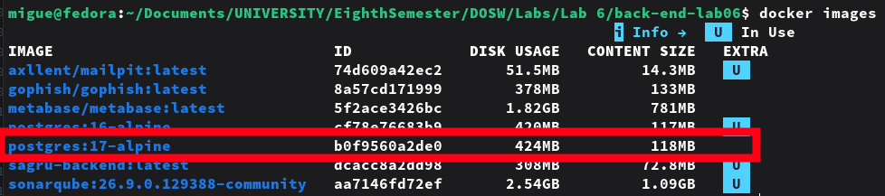

---

# 11. Crear el script de base de datos

Crear:

```text
database/001_create_schema.sql
```

Contenido:

```sql
CREATE TABLE tasks (

    id BIGSERIAL PRIMARY KEY,
    title VARCHAR(120) NOT NULL,
    description VARCHAR(500),
    status VARCHAR(20) NOT NULL DEFAULT 'PENDING',
    priority VARCHAR(10) NOT NULL DEFAULT 'MEDIUM',
    due_date DATE,
    created_at TIMESTAMP NOT NULL DEFAULT CURRENT_TIMESTAMP,

    CONSTRAINT chk_task_status
        CHECK (status IN ('PENDING', 'IN_PROGRESS', 'COMPLETED')),

    CONSTRAINT chk_task_priority
        CHECK (priority IN ('LOW', 'MEDIUM', 'HIGH'))
);
```

---

# 12. Crear el contenedor PostgreSQL

Crear un volumen para conservar la información de la base de datos:

```bash
docker volume create todo-postgres-data
```
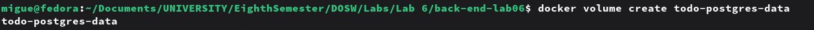
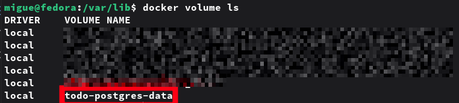


Luego crear y ejecutar el contenedor:

```bash
docker run -d \
  --name todo-postgres \
  -e POSTGRES_DB=todo_db \
  -e POSTGRES_USER=todo_user \
  -e POSTGRES_PASSWORD=todo_password \
  -p 5432:5432 \
  -v todo-postgres-data:/var/lib/postgresql/data \
  postgres:17-alpine
```
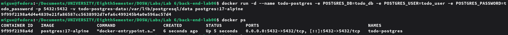

En Windows PowerShell puede ejecutarse en una sola línea:

```powershell
docker run -d --name todo-postgres -e POSTGRES_DB=todo_db -e POSTGRES_USER=todo_user -e POSTGRES_PASSWORD=todo_password -p 5432:5432 -v todo-postgres-data:/var/lib/postgresql/data postgres:17-alpine
```
Created.png)
Verificar que el contenedor esté ejecutándose:

```bash
docker ps
```

Consultar los logs:

```bash
docker logs todo-postgres
```
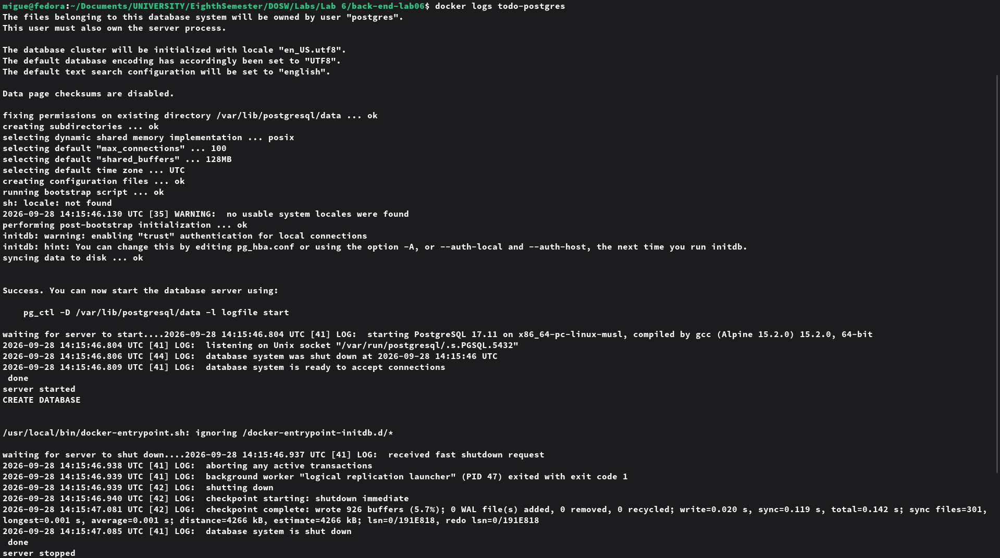
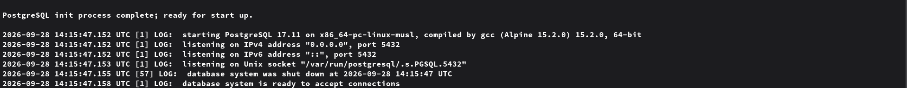

---

# 13. Crear el esquema dentro de PostgreSQL

Copiar el script SQL al contenedor:

```bash
docker cp database/001_create_schema.sql todo-postgres:/001_create_schema.sql
```

Ejecutar el script:

```bash
docker exec -it todo-postgres \
  psql -U todo_user -d todo_db \
  -f /001_create_schema.sql
```
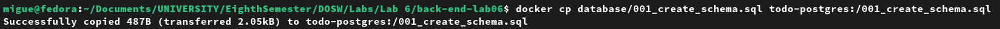

En Windows PowerShell:


```powershell
docker exec -it todo-postgres psql -U todo_user -d todo_db -f /001_create_schema.sql
```
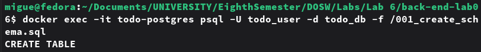

Conectarse a PostgreSQL:

```bash
docker exec -it todo-postgres psql -U todo_user -d todo_db
```

Dentro de PostgreSQL verificar la tabla:

```sql
\dt
```

y consultar:

```sql
SELECT * FROM tasks;
```

Salir:

```text
\q
```
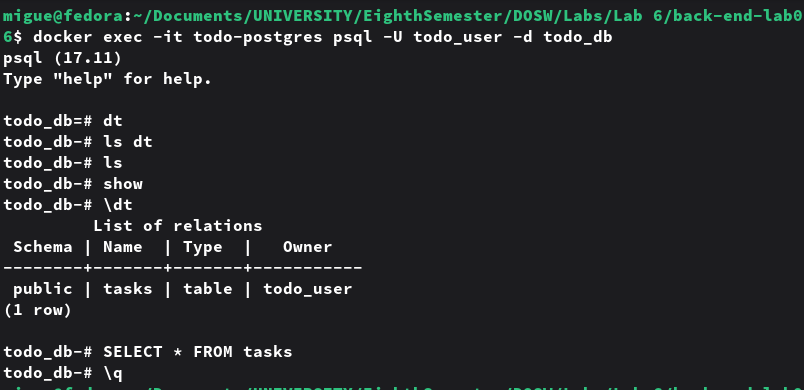

---

# 14. Detener y volver a iniciar PostgreSQL

Para detener el contenedor:

```bash
docker stop todo-postgres
```

Para iniciarlo nuevamente:

```bash
docker start todo-postgres
```

Si se desea eliminar completamente el contenedor:

```bash
docker rm -f todo-postgres
```

El volumen seguirá existiendo y conservará los datos.

Para eliminar también los datos:

```bash
docker volume rm todo-postgres-data
```
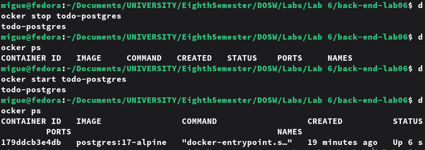

---

# PARTE 3 · MAPEO ORM CON JPA

# 15. Crear los enums

Crear:

```text
entity/TaskStatus.java
```

```java
public enum TaskStatus {
    PENDING,
    IN_PROGRESS,
    COMPLETED
}
```

Crear:

```text
entity/TaskPriority.java
```

```java
public enum TaskPriority {
    LOW,
    MEDIUM,
    HIGH
}
```

---

# 16. Crear la entidad

Crear:

```text
entity/TaskEntity.java
```

Debe utilizar:

```java
@Entity
@Table(name = "tasks")
```

y mapear:

```text
id
title
description
status
priority
dueDate
createdAt
```

Utilizar, según corresponda:

```java
@Id
@GeneratedValue
@Column
@Enumerated
```
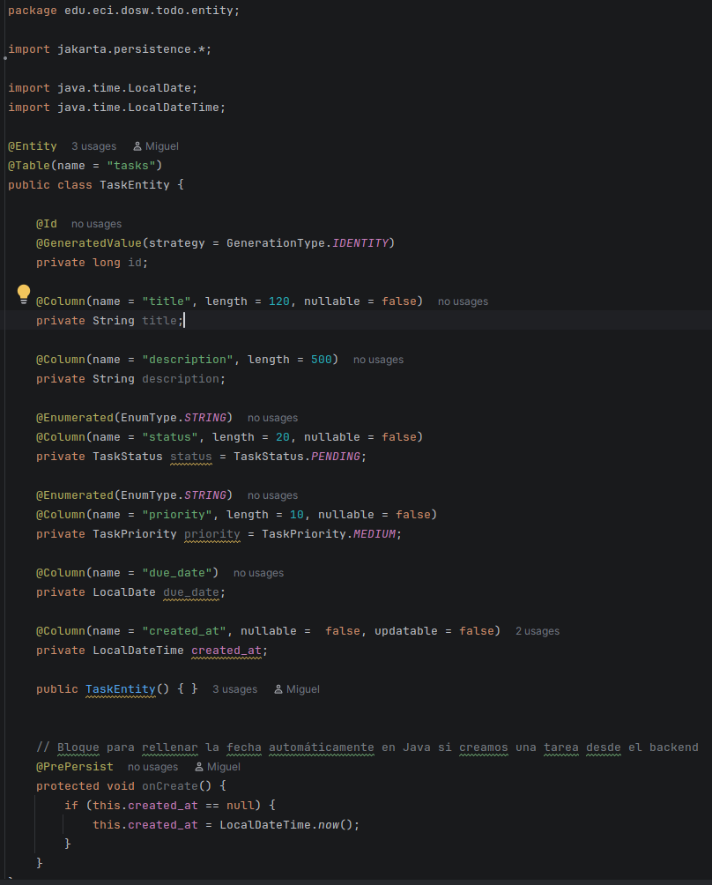

---

# 17. Configurar PostgreSQL en Spring Boot

En:


```text
application.properties
```

adicionar:

```properties
spring.datasource.url=${DB_URL:jdbc:postgresql://localhost:5432/todo_db}
spring.datasource.username=${DB_USER:todo_user}
spring.datasource.password=${DB_PASSWORD:todo_password}

spring.jpa.hibernate.ddl-auto=validate


spring.jpa.show-sql=true
spring.jpa.properties.hibernate.format_sql=true
```

---

# 18. Crear el Repository


Crear:

```text
repository/TaskRepository.java
```

Debe extender:

```java
JpaRepository<TaskEntity, Long>
```

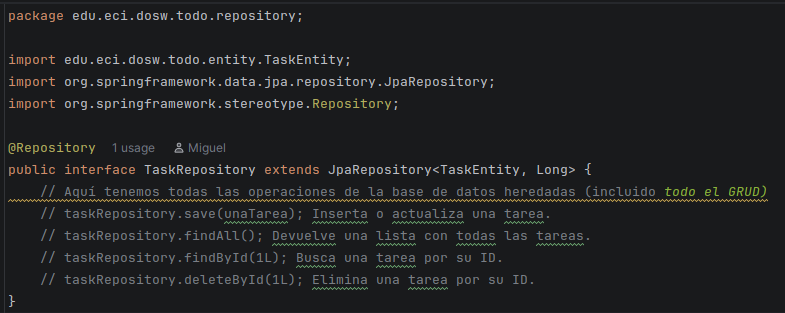

---

# PARTE 4 · DTOs (Data Transfer Object)
# 19. Crear los DTOs

Crear:

```text
dto/TaskCreateRequest.java
dto/TaskUpdateRequest.java
dto/TaskResponse.java
```

## TaskCreateRequest

Debe recibir:

```text
title
description
priority
dueDate
```

No debe recibir:

```text
id
createdAt
```
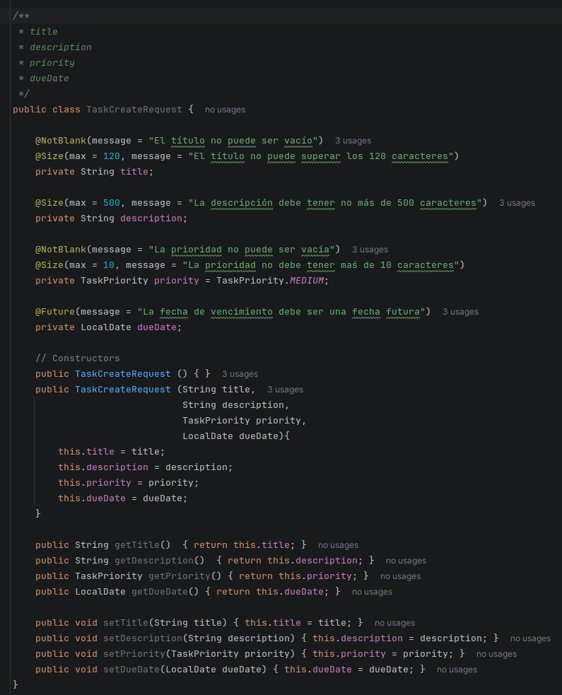

---

## TaskUpdateRequest

Debe permitir modificar:

```text
title
description
status
priority
dueDate
```

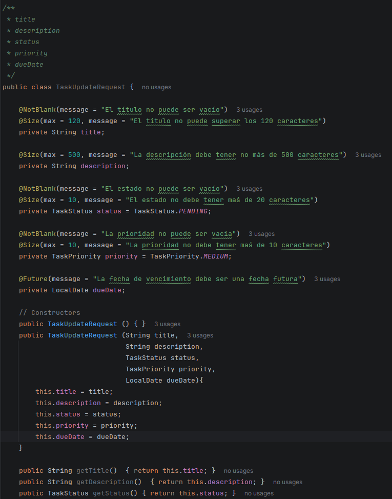
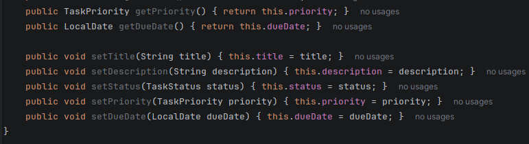

---

## TaskResponse

Debe retornar:

```text
id
title
description
status
priority
dueDate
createdAt
```
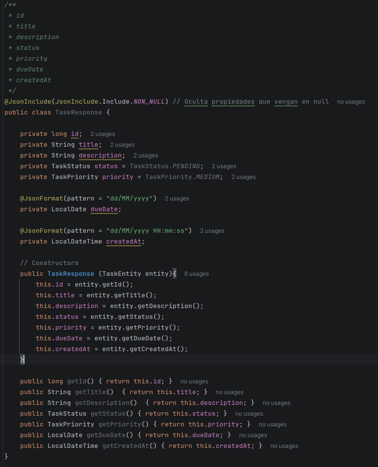

---

# PARTE 5 · CAPA DE SERVICIOS

# 20. Crear la interfaz TaskService

Crear:

```text
service/TaskService.java
```

Definir:

```java
List<TaskResponse> findAll();
TaskResponse findById(Long id);
TaskResponse create(TaskCreateRequest request);
TaskResponse update(Long id, TaskUpdateRequest request);
void delete(Long id);
```

---

# 21. Crear TaskServiceImpl

Crear:

```text
service/TaskServiceImpl.java
```

Utilizar:

```java
@Service
```

e inyección por constructor.

La implementación deberá:

- consultar el Repository,
- transformar Entity ↔ DTO,
- asignar valores por defecto,
- validar existencia de tareas,
- actualizar tareas,
- eliminar tareas,
- lanzar excepciones cuando corresponda.

---

# 22. Valores por defecto

Al crear una tarea:

```text
status = PENDING
priority = MEDIUM
createdAt = fecha y hora actual
```

La prioridad enviada por el usuario puede reemplazar el valor `MEDIUM`.

Los pasos llevados hasta el momento:

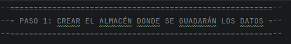
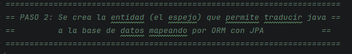
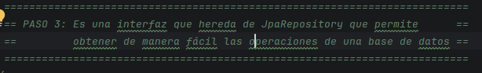
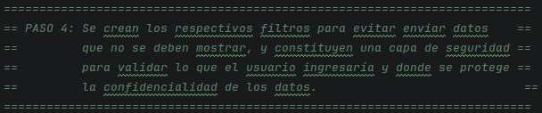
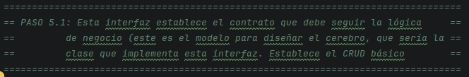
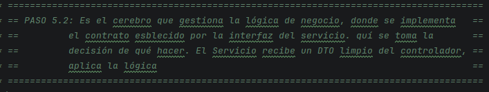

---

# PARTE 6 · PRUEBAS UNITARIAS DEL SERVICE

# 23. Crear TaskServiceTest

Crear:

```text
TaskServiceTest.java
```

Utilizar:

```text
JUnit 5
Mockito
AssertJ
```

El `TaskRepository` debe ser un Mock.

Casos mínimos:

```text
findAll_shouldReturnTasks
findById_shouldReturnTaskWhenExists
findById_shouldThrowExceptionWhenTaskDoesNotExist
create_shouldCreateTask
create_shouldAssignDefaultStatus
update_shouldUpdateExistingTask
update_shouldThrowExceptionWhenTaskDoesNotExist
delete_shouldDeleteExistingTask
delete_shouldThrowExceptionWhenTaskDoesNotExist
```

Ejecutar:

```bash
mvn test
```
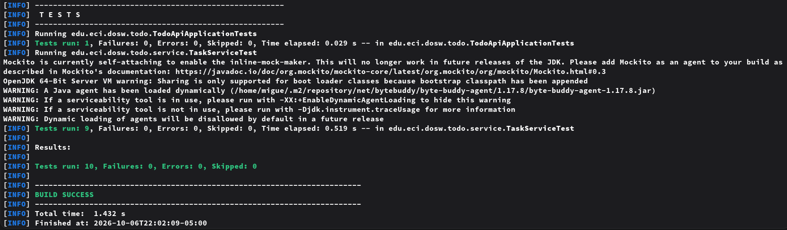

---

# 24. JaCoCo

Adicionar JaCoCo al `pom.xml`.

Ejecutar:

```bash
mvn clean verify
```

Revisar:

```text
backend/target/site/jacoco/index.html
```

Meta sugerida:

```text
80 %
```
Por cobertura, se cumplió con probar todas las funciones, a expeción de equals y hashCode,
debido a que en ocasiones no era necesario. Por ello, resultó con 58% de cobertura, debido
a que cada clase tenía implementado estas dos.

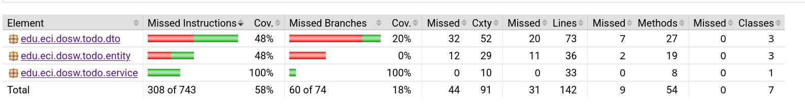

---

# PARTE 7 · API REST

# 25. Crear TaskController

Crear:

```text
controller/TaskController.java
```

Utilizar:

```java
@RestController
@RequestMapping("/api/v1/tasks")
```

---

# 26. Endpoints requeridos

| Operación | Método | Endpoint | Código |
|---|---|---|---:|
| Listar tareas | GET | `/api/v1/tasks` | 200 |
| Consultar tarea | GET | `/api/v1/tasks/{id}` | 200 / 404 |
| Crear tarea | POST | `/api/v1/tasks` | 201 |
| Actualizar tarea | PUT | `/api/v1/tasks/{id}` | 200 / 404 |
| Eliminar tarea | DELETE | `/api/v1/tasks/{id}` | 204 / 404 |

---

# 27. Crear tarea

```http
POST /api/v1/tasks
Content-Type: application/json
```

```json
{
  "title": "Terminar laboratorio DOSW",
  "description": "Completar pruebas del backend",
  "priority": "HIGH",
  "dueDate": "2026-09-25"
}
```

Respuesta:

```http
201 Created
```

```json
{
  "id": 1,
  "title": "Terminar laboratorio DOSW",
  "description": "Completar pruebas del backend",
  "status": "PENDING",
  "priority": "HIGH",
  "dueDate": "2026-09-25",
  "createdAt": "2026-09-21T10:30:00"
}
```

---

# 28. Consultar todas las tareas

```http
GET /api/v1/tasks
```

---

# 29. Consultar una tarea

```http
GET /api/v1/tasks/1
```

Si no existe:

```http
404 Not Found
```

---

# 30. Actualizar tarea

```http
PUT /api/v1/tasks/1
Content-Type: application/json
```

```json
{
  "title": "Terminar laboratorio DOSW",
  "description": "Backend y Front-end terminados",
  "status": "IN_PROGRESS",
  "priority": "HIGH",
  "dueDate": "2026-09-25"
}
```

---

# 31. Eliminar tarea

```http
DELETE /api/v1/tasks/1
```

Respuesta:

```http
204 No Content
```
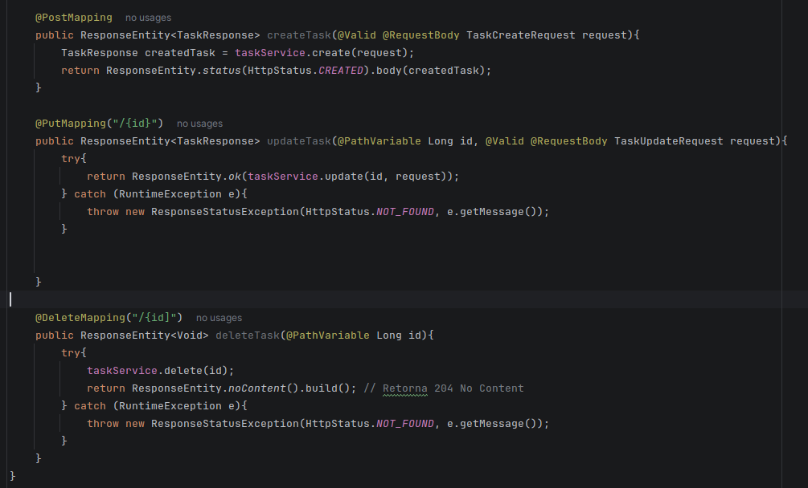
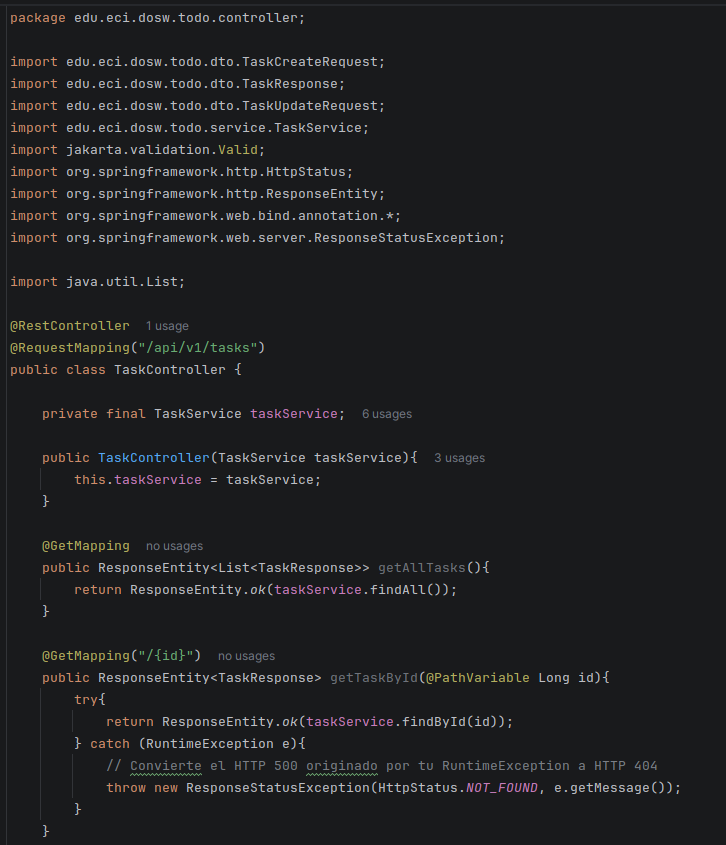

---

# PARTE 8 · MANEJO DE ERRORES

# 32. Crear TaskNotFoundException

Crear:

```text
exception/TaskNotFoundException.java
```

---

# 33. Crear GlobalExceptionHandler

Crear:

```text
exception/GlobalExceptionHandler.java
```

Utilizar:

```java
@RestControllerAdvice
```

Ejemplo:

```json
{
  "status": 404,
  "message": "Task with id 99 was not found"
}
```
Refactorización de la clase TaskController
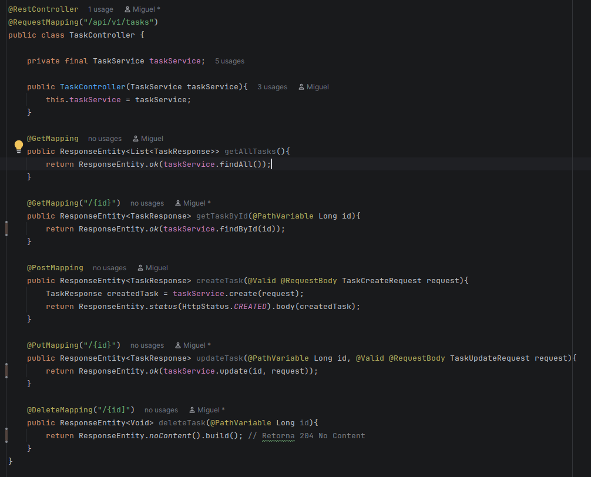

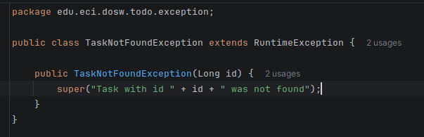

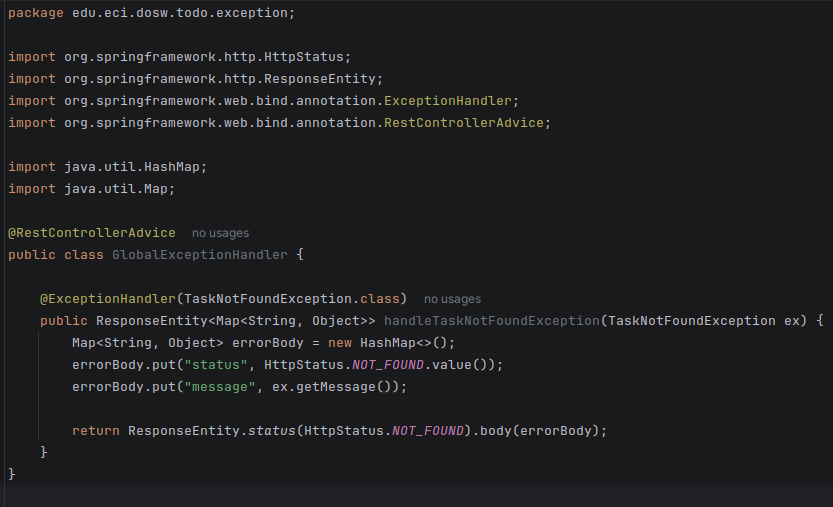


---

# PARTE 9 · PRUEBAS DEL CONTROLLER

# 34. Crear TaskControllerTest

Crear:

```text
TaskControllerTest.java
```

Utilizar:

```text
MockMvc: carga únicamente el contexto web de Spring necesario para el controlador especificado.
Mockito: 
ObjectMapper: Es el motor principal de la librería Jackson. En las pruebas de creación (POST) y actualización (PUT), el controlador espera recibir texto en formato JSON. ObjectMapper toma las instancias de Java (ej. TaskCreateRequest) y las serializa, convirtiéndolas en las cadenas JSON exactas que MockMvc enviará en el cuerpo de la petición.
```

El Service debe ser simulado.

Casos mínimos:

```text
GET /tasks → 200

GET /tasks/{id}{
  "title": "Terminar laboratorio DOSW",
  "description": "Backend y Front-end terminados",
  "status": "IN_PROGRESS",
  "priority": "HIGH",
  "dueDate": "2026-09-25"
}
    existente → 200
    inexistente → 404

POST /tasks
    válido → 201
    inválido → 400

PUT /tasks/{id}
    existente → 200
    inexistente → 404

DELETE /tasks/{id}
    existente → 204
```
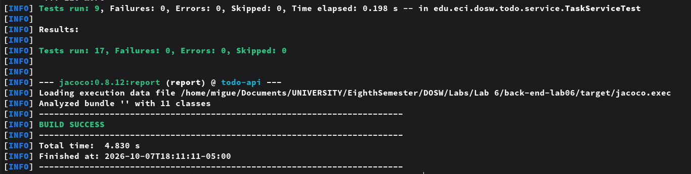

---

# PARTE 10 · PROBAR EL BACK-END

# 35. Ejecutar PostgreSQL

Si el contenedor ya fue creado:

```bash
docker start todo-postgres
```

Verificar:

```bash
docker ps
```

---

# 36. Ejecutar Spring Boot

```bash
cd backend
mvn spring-boot:run
```

---

# 37. Probar la API

Puede utilizarse:

```text
Postman
Bruno
Insomnia
curl
```

Ejemplo:

```bash
curl http://localhost:8080/api/v1/tasks
```

### mvn spring-boot:run

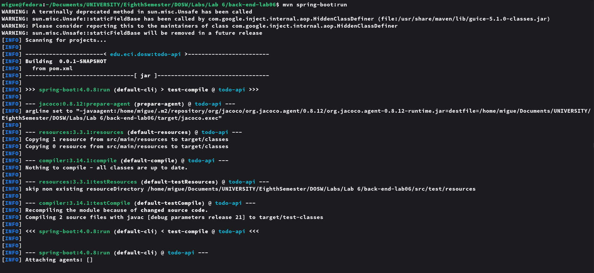
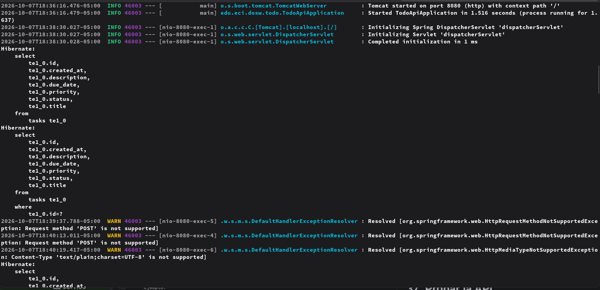

### Curl

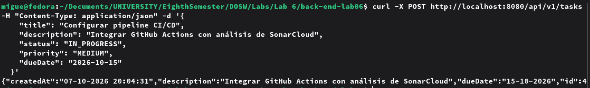

### Postman

#### 1. POST - Crear tarea (Válido → 201 Created)

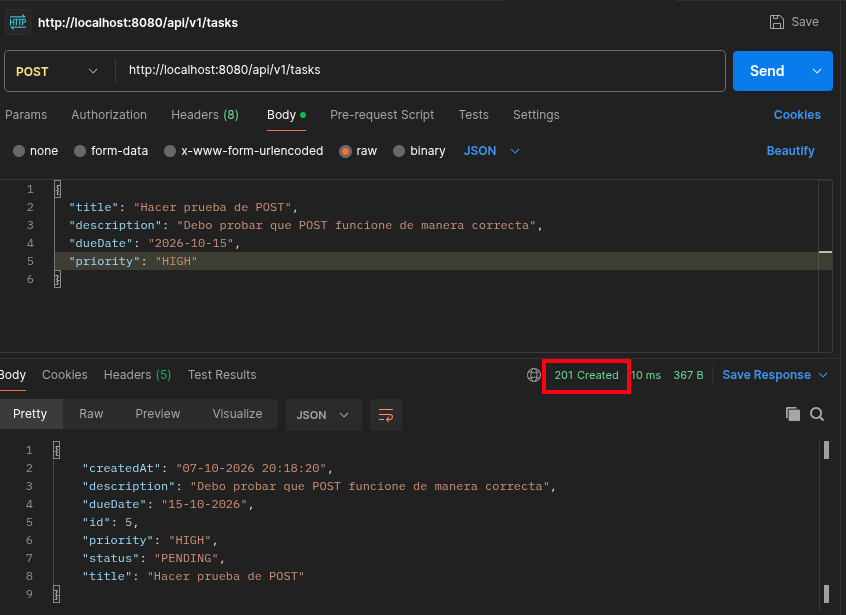

#### 2. POST - Crear tarea con datos inválidos (Inválido → 400 Bad Request)

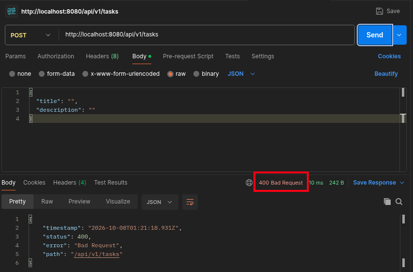

#### 3. GET - Obtener todas las tareas (200 OK)

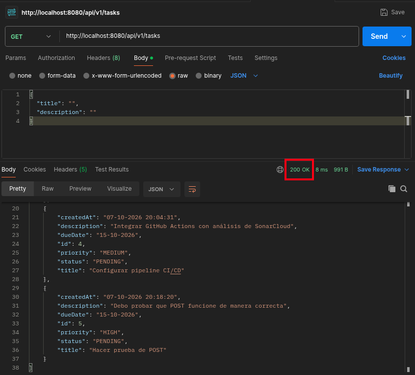

#### 4. GET - Obtener tarea por ID (Existente → 200 OK)

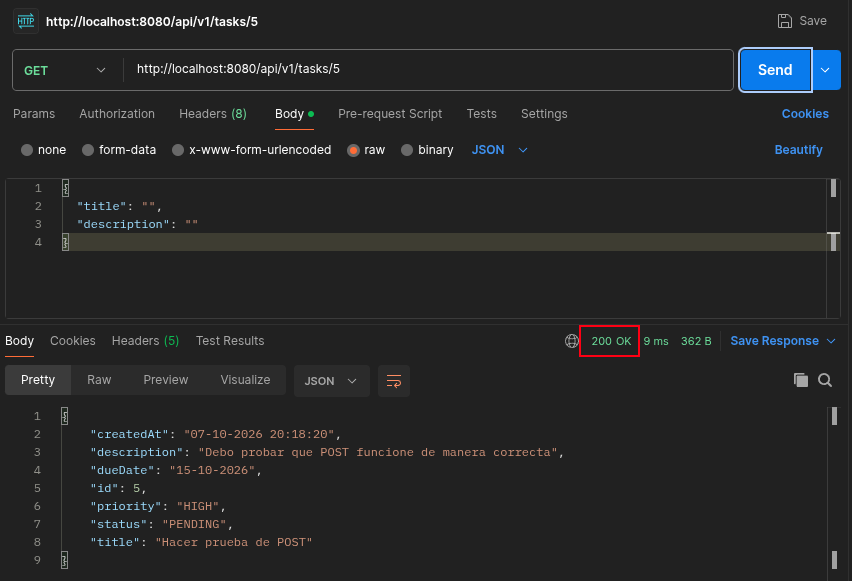

#### 5. GET - Obtener tarea inexistente (Inexistente → 404 Not Found)

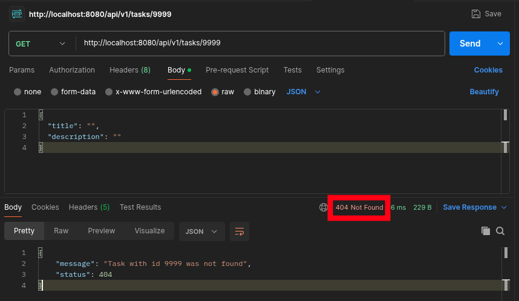

#### 6. PUT - Actualizar tarea (Existente → 200 OK)

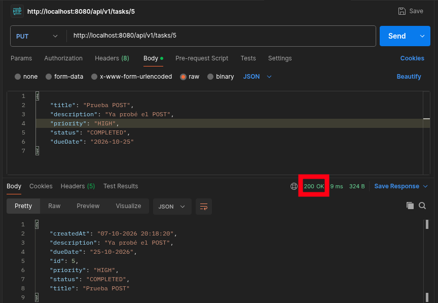

#### 7. PUT - Actualizar tarea inexistente (Inexistente → 404 Not Found)

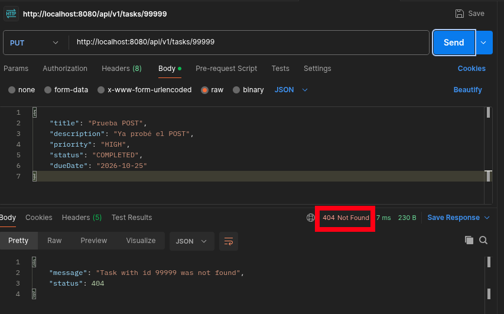

#### 8. DELETE - Eliminar tarea (Existente → 204 No Content)
##### Delete
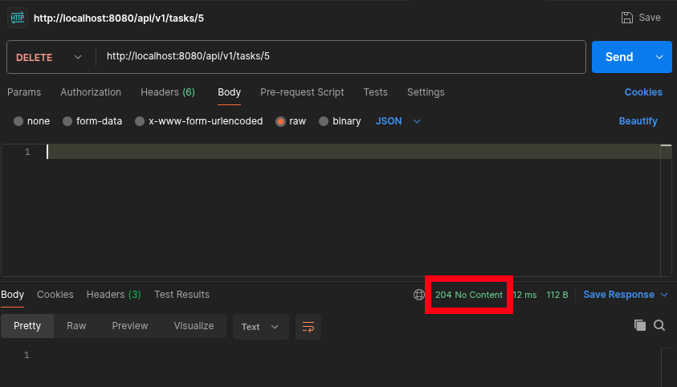
##### Get, can not find deleted task
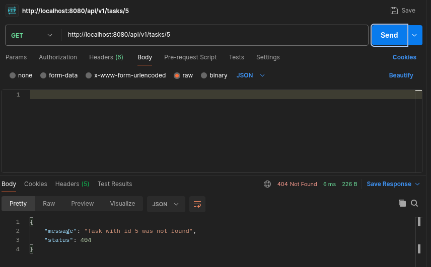

#### Final console screen
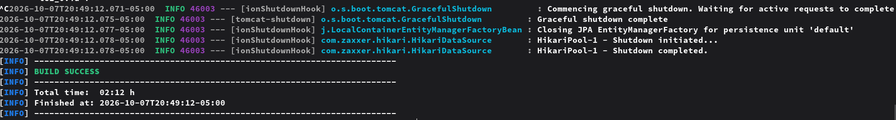

---

# PARTE 12 · CONSUMO DE RECURSOS REST

# 45. Configurar CORS

Spring Boot:

```text
http://localhost:8080
```

Crear:

```text
config/WebConfig.java
```

y permitir el origen:

```text
http://localhost:5173
```


---

# PARTE 14 · INTEGRACIÓN FULL STACK

# 48. Ejecutar PostgreSQL

```bash
docker start todo-postgres
```

Verificar:

```bash
docker ps
```

---

# 49. Ejecutar Back-end

```bash
cd backend
mvn spring-boot:run
```

---

# 51. Demostración obligatoria

Desde React realizar:

```text
Crear tarea
    ↓
Consultar tareas
    ↓
Editar tarea
    ↓
Cambiar estado
    ↓
Eliminar tarea
```

Flujo esperado:

```text
React
   ↓
HTTP
   ↓
REST Controller
   ↓
Service
   ↓
Repository
   ↓
JPA / Hibernate
   ↓
PostgreSQL
```

---

# PARTE 15 · BONUS · VISTA DE CALENDARIO SEMANAL

# 52. Crear TaskCalendar

Crear un componente adicional:

```text
TaskCalendar.jsx
```

Debe mostrar:

```text
              SEMANA 21 - 27 SEPTIEMBRE

-------------------------------------------------------------
 LUN        MAR        MIÉ        JUE        VIE        SÁB       DOM
-------------------------------------------------------------

Lab DOSW              Parcial              Entrega
HIGH                  MEDIUM               HIGH

-------------------------------------------------------------

[ < Semana anterior ]          [ Semana siguiente > ]
```

---

# 53. Requisitos del calendario

La vista debe:

- mostrar los siete días,
- ubicar las tareas según `dueDate`,
- mostrar estado,
- mostrar prioridad,
- permitir semana anterior,
- permitir semana siguiente,
- permitir seleccionar una tarea para editar,
- actualizarse después de crear, modificar o eliminar una tarea.

---

# 54. Endpoint opcional para el bono

Se puede implementar:

```http
GET /api/v1/tasks?from=2026-09-21&to=2026-09-27
```

En el Repository:

```java
findByDueDateBetween(...)
```

---

# 59. Referencias

Spring Initializr  
https://start.spring.io/

Spring Boot  
https://spring.io/projects/spring-boot

Spring Data JPA  
https://spring.io/projects/spring-data-jpa

PostgreSQL  
https://www.postgresql.org/

Docker PostgreSQL  
https://hub.docker.com/_/postgres
