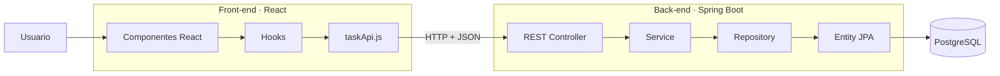
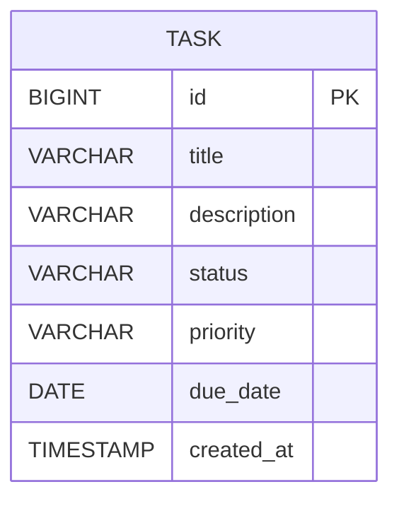

# LABORATORIO · ToDo FULL STACK

**Escuela Colombiana de Ingeniería Julio Garavito**  
**Curso:** Desarrollo y Operaciones de Software - DOSW  
**Caso de estudio:** ToDo · Sistema para gestión de tareas  
**Docente:** Rodrigo Gualtero

---

# 1. Requerimientos funcionales

La aplicación **ToDo** permitirá gestionar tareas personales desde una interfaz web desarrollada en React.

La solución estará compuesta por:

- Back-end desarrollado con **Java + Spring Boot + Maven**.
- API REST para exponer las operaciones sobre tareas.
- Persistencia con **PostgreSQL**.
- PostgreSQL ejecutado mediante **Docker**, descargando y utilizando directamente la imagen oficial de PostgreSQL.
- Persistencia implementada con **JPA + Spring Data JPA**.
- Front-end desarrollado con **React + Vite**.
- Comunicación Front-end ↔ Back-end mediante consumo de recursos REST.
- Pruebas unitarias en Back-end y Front-end.

## RF-01 · Crear tareas

El usuario podrá registrar una nueva tarea indicando:

- título,
- descripción,
- prioridad,
- fecha límite.

El sistema asignará automáticamente:

- identificador,
- estado inicial,
- fecha de creación.

---

## RF-02 · Consultar tareas

El usuario podrá visualizar todas las tareas registradas.

Por cada tarea se deberá mostrar como mínimo:

- título,
- descripción,
- estado,
- prioridad,
- fecha límite.

---

## RF-03 · Consultar una tarea

El usuario podrá consultar el detalle de una tarea específica a partir de su identificador.

---

## RF-04 · Editar tareas

El usuario podrá modificar:

- título,
- descripción,
- estado,
- prioridad,
- fecha límite.

---

## RF-05 · Eliminar tareas

El usuario podrá eliminar una tarea existente.

---

## RF-06 · Gestionar el estado de una tarea

Una tarea podrá manejar los siguientes estados:

```text
PENDING
IN_PROGRESS
COMPLETED
```

---

## RF-07 · Gestionar prioridad

Las tareas podrán clasificarse con las siguientes prioridades:

```text
LOW
MEDIUM
HIGH
```

---

## RF-08 · Persistir la información

Toda la información de las tareas deberá almacenarse en PostgreSQL.

---

## RF-09 · Consumir la API desde React

Todas las operaciones del CRUD realizadas desde React deberán ejecutarse consumiendo recursos de la API REST.

El Front-end no manejará persistencia local como fuente principal de información.

---

## RF-10 · Manejo de errores

La API deberá responder correctamente cuando:

- una tarea no exista,
- se reciban datos inválidos,
- una operación no pueda completarse.

---

## RF-11 · Pruebas automatizadas

El sistema deberá incluir pruebas unitarias para:

- capa de servicios,
- controladores REST,
- componentes principales del Front-end.

---

# 2. Historias de usuario

## HU-01 · Crear una tarea

**Como** usuario de la aplicación  
**quiero** crear una tarea  
**para** registrar una actividad que debo realizar.

### Criterios de aceptación

- Se debe poder ingresar título.
- Se debe poder ingresar descripción.
- Se debe poder seleccionar prioridad.
- Se debe poder indicar fecha límite.
- La tarea debe iniciar en estado `PENDING`.
- La tarea debe almacenarse en PostgreSQL.
- La tarea debe aparecer inmediatamente en el listado después de ser creada.

---

## HU-02 · Consultar todas las tareas

**Como** usuario  
**quiero** visualizar las tareas registradas  
**para** conocer las actividades que tengo pendientes.

### Criterios de aceptación

- El sistema debe mostrar todas las tareas.
- Debe mostrarse estado.
- Debe mostrarse prioridad.
- Debe mostrarse fecha límite cuando exista.
- La información debe provenir de la API REST.

---

## HU-03 · Consultar una tarea

**Como** usuario  
**quiero** consultar una tarea específica  
**para** revisar toda su información.

### Criterios de aceptación

- La tarea debe poder consultarse por identificador.
- Si la tarea existe, la API debe responder `200 OK`.
- Si la tarea no existe, la API debe responder `404 Not Found`.

---

## HU-04 · Editar una tarea

**Como** usuario  
**quiero** modificar una tarea  
**para** mantener actualizada su información.

### Criterios de aceptación

- Se podrá modificar título.
- Se podrá modificar descripción.
- Se podrá modificar prioridad.
- Se podrá modificar fecha límite.
- Los cambios deben persistirse en PostgreSQL.
- La interfaz debe reflejar los cambios realizados.

---

## HU-05 · Cambiar estado de una tarea

**Como** usuario  
**quiero** cambiar el estado de una tarea  
**para** representar su avance.

### Criterios de aceptación

La tarea podrá utilizar los estados:

```text
PENDING
IN_PROGRESS
COMPLETED
```

---

## HU-06 · Eliminar una tarea

**Como** usuario  
**quiero** eliminar una tarea  
**para** retirar actividades que ya no necesito gestionar.

### Criterios de aceptación

- Solo se podrá eliminar una tarea existente.
- Después de eliminarla no deberá aparecer en el listado.
- La API debe responder `204 No Content`.

---

## HU-07 · Visualizar errores

**Como** usuario  
**quiero** recibir mensajes claros cuando una operación falle  
**para** entender qué ocurrió.

### Criterios de aceptación

- El Front-end debe informar errores de creación, consulta, actualización o eliminación.
- La API deberá utilizar códigos HTTP apropiados.
- No se deberá mostrar un error genérico `500` para situaciones correspondientes a `400` o `404`.

---

# 3. Bono · Vista semanal de calendario

## HU-B01 · Visualizar tareas en un calendario semanal

**Como** usuario  
**quiero** visualizar mis tareas en una vista de calendario semanal  
**para** identificar fácilmente qué actividades debo realizar cada día.

### Criterios de aceptación

- Deben mostrarse los siete días de la semana.
- Cada tarea debe mostrarse en el día correspondiente a `dueDate`.
- Se debe poder navegar a la semana anterior.
- Se debe poder navegar a la semana siguiente.
- Se debe mostrar prioridad.
- Se debe mostrar estado.
- Al seleccionar una tarea se debe poder editar.
- La información debe provenir de la misma API REST utilizada por el CRUD.

---

# 4. Arquitectura objetivo

La aplicación deberá implementar una arquitectura similar a la siguiente:



---

# 5. Modelo de datos

Una tarea tendrá como mínimo:

| Campo | Tipo | Obligatorio | Descripción |
|---|---|---:|---|
| `id` | Long | Sí | Identificador único |
| `title` | String | Sí | Título |
| `description` | String | No | Descripción |
| `status` | Enum | Sí | Estado |
| `priority` | Enum | Sí | Prioridad |
| `dueDate` | LocalDate | No | Fecha límite |
| `createdAt` | LocalDateTime | Sí | Fecha de creación |

Estados:

```text
PENDING
IN_PROGRESS
COMPLETED
```

Prioridades:

```text
LOW
MEDIUM
HIGH
```

---

# 6. Modelo entidad-relación


